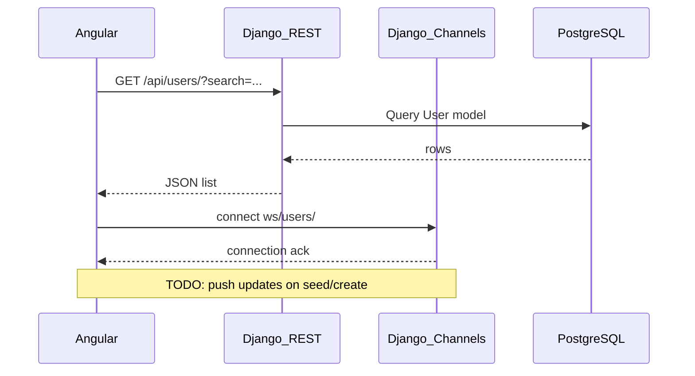

# Interview Exercise — User Directory

Build a small full-stack app that loads users from a relational database and lets you search them, with optional real-time updates over WebSockets.

The backend seeds data from [JSONPlaceholder](https://jsonplaceholder.typicode.com/users) via `python manage.py seed_users`. Your job is to complete the stubs in both `backend/` and `frontend/`.

## Architecture



## Your tasks

### Backend

1. **Search filter** — In `backend/users/views.py`, implement the `?search=` query param to filter users by name or email (case-insensitive).
2. **WebSocket broadcast** — In `backend/users/consumers.py`, join a channel group and broadcast when users are created or updated.

### Frontend

3. **UserService** — Wire loading and error states in `frontend/src/app/services/user.service.ts` and `app.component.ts`.
4. **SearchBar** — Implement controlled input in `search-bar.component.ts` (placeholder: `Search by name or email...`).
5. **UserCard** — Display name, email, company, and city.
6. **UserList** — Responsive card grid (`auto-fill`, `minmax(250px, 1fr)`) with `No users found` when empty.
7. **LoadingSpinner / ErrorMessage** — Show while fetching and on failure; wire in `app.component.html`.
8. **WebSocketService** — Connect to `/ws/users/` and react to live updates.

### Optional (if time allows)

- Sorting, expandable cards
- Write API (POST/PATCH) with WebSocket notifications

## API contract

```
GET /api/users/
→ [
  {
    "id": 1,
    "external_id": 1,
    "name": "Leanne Graham",
    "email": "Sincere@april.biz",
    "company": "Romaguera-Crona",
    "city": "Gwenborough",
    "created_at": "2026-06-30T12:00:00Z"
  }
]

GET /api/users/?search=leanne
→ filtered list (TODO: implement on backend)
```

## Stub file map

```
backend/users/views.py              REST list + search TODO
backend/users/consumers.py          WebSocket consumer TODO
frontend/src/app/services/        user.service.ts, websocket.service.ts
frontend/src/app/components/      SearchBar, UserCard, UserList, LoadingSpinner, ErrorMessage
frontend/src/app/app.component.*  Wire loading, error, search, list
```

## Setup

See [README.md](./README.md) for Docker Compose and native dev instructions.

Plain Angular and Django only for the exercise — no extra UI libraries required.
